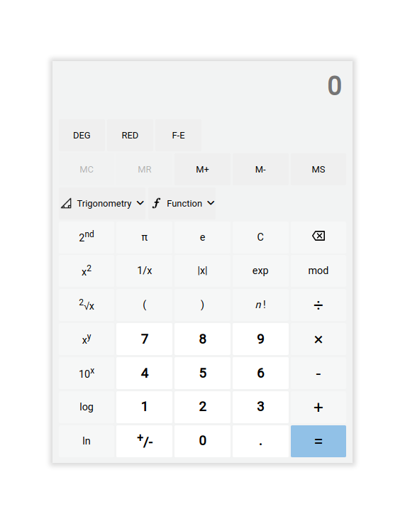

# Scientific Calculator

- A TypeScript calculator is a programme that lets users perform mathematical operations in their web browser.

- You can also run it directly in a web browser without the need for any additional software installation. This calculator is easy to use and has a very interactive UI design.

- Source Code is splitted in the form of modules to increase the readabilty and to maintain the project easily.

## 🚀 Live Demonstraion

[Preview Calculator](https://jupinsimform.github.io/lms-ts-calculator/)

## Tech Stack

- This Project is Build With Some Famous Tech And Tools Which Are Mentioned Below... 👇
  

## ScreenShot

## Features

#### 1] Interactive user interface

#### 2] Responsive design for web and mobile screens

#### 3] perform all basic arithmetic operations, like :

- Addition ( + )
- Subtraction ( - )
- Multiplication ( \* )
- Division ( / )
- Modulo (%)

#### 4] perform all trigonometric functions like

- Sine (SIN)
- Cosine (COS)
- Tangent (TAN)

#### 5] Logarithmic Functions

- log x
- log x base y
- ln x

#### 6] Supplementary Operations

- y root x
- Factorialx
- Square Root
- Cube Root
- Inverse of x
- Sign Change
- Floor of x
- Ceil of x
- fixed to Component
- Degree To Radian and vice-versa

#### 7] Also, you can store memory with memory functions and perform pluses and minuses on stored memory.

##### 🛑 Important

- for evaluate long expression using parenthesis you must add operator sign to get the correct result.
  > Example
  >
  > > write `5+5*(4*2)` \
  > > instead of `5+5(4\*2)`
